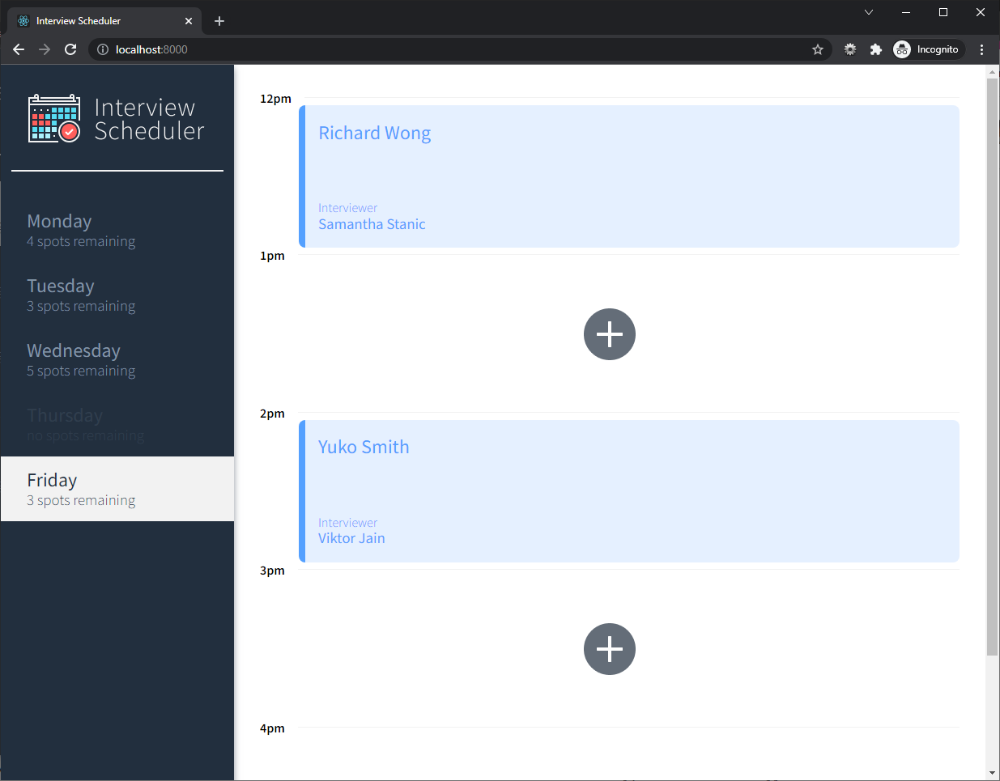
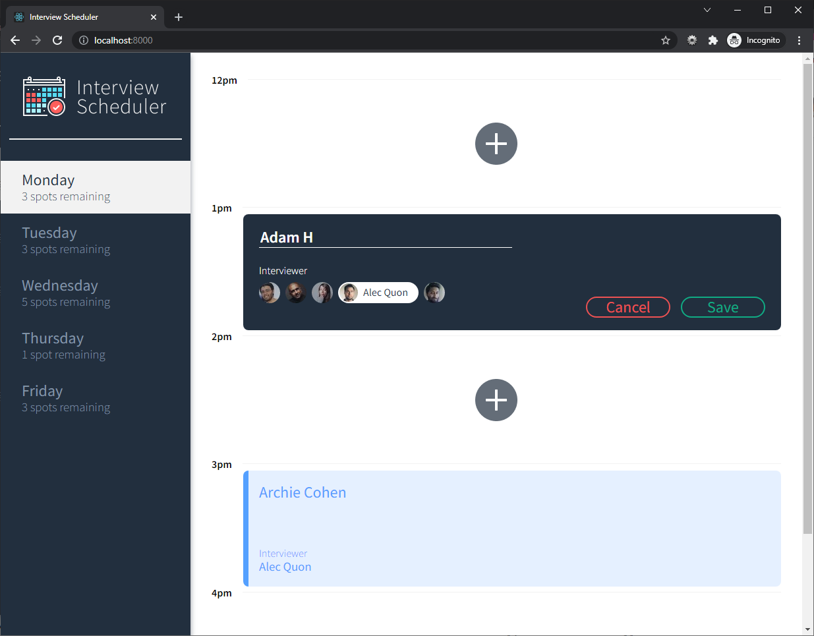
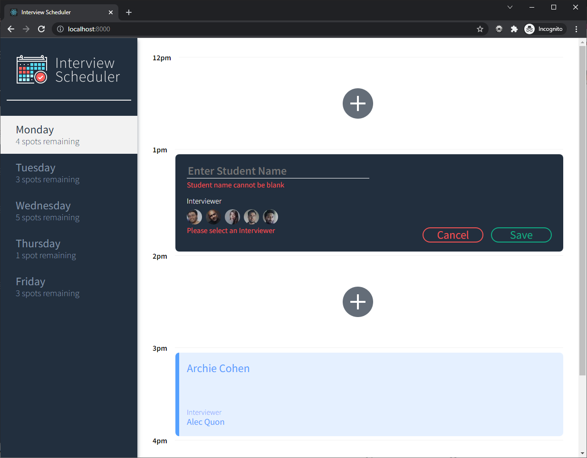
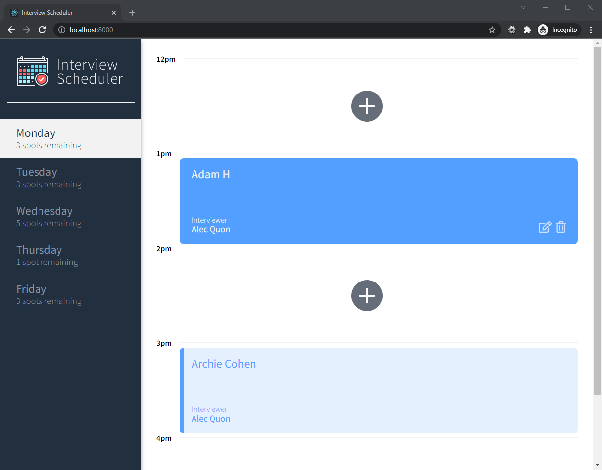
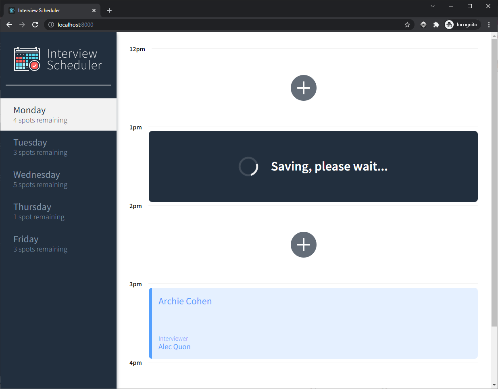

<h1 align="center"><a href="https://scheduler-project-lhl.netlify.app/">Interview Scheduler</a></h1> 

## Table Of Contents
- [Summary](#summary)
  - [Features](#features)
  - [Demo](#demo)
- [Setup](#setup)
  - [Dependencies](#dependencies)
  - [Resources](#resources)

# Summary
Interview Scheduler is a React application that allows users to book and cancel interviews. A combination of concise API and a WebSocket server are used to build a realtime experience.

The app is deployed and can be viewed at [scheduler.hirzalla.ca](https://scheduler-project-lhl.netlify.app/).

## Features
<hr>

- Supports WebSockets for a flawless user-experience which provides real-time updates
- Automated deployment: CI/CD using CircleCI, API hosted on Heroku, client build deployed at Netlify
- Choose an available time-slot and book a new interview!
- Provide your name and choose one of the available interviewers for your appointment
- Edit or delete an existing appointment
- View how many available interview spots are remaining each day
- Navigate through different days of the week by clicking the sidebar

## Screenshots
<hr>








## Setup
<hr>

### You can use the published build deployed at [scheduler.hirzalla.ca](https://scheduler-project-lhl.netlify.app/)

### Install dependencies with 
```sh
npm i
```

### Running Webpack Development Server

<i>Needs an API server running separately. You can clone [Lighthouse Labs' repository](https://github.com/lighthouse-labs/scheduler-api)</i>
```sh
npm start
```

### Running Jest Test Framework

```sh
npm test
```

### Running Storybook Visual Testbed

```sh
npm run storybook
```

### Running Cypress Tests

```sh
npm run cypress
```

## Dependencies
- [React](https://reactjs.org/)
- [Axios](https://github.com/axios/axios)
- [Classnames](https://github.com/axios/axios)
- [Normalize.css](https://www.npmjs.com/package/normalize.css?activeTab=versions)
- [React-DOM](https://www.npmjs.com/package/react-dom)
- [React-Scripts](https://www.npmjs.com/package/react-scripts)

### Dev
- [Babel](https://babeljs.io/)
- [Storybook](https://storybook.js.org/)
- [Jest](https://jestjs.io/en/)
- [Testing Library](https://testing-library.com/)
- [Cypress](https://www.npmjs.com/package/cypress)
- [Node-sass](https://www.npmjs.com/package/node-sass)
- [Prop-types](https://www.npmjs.com/package/prop-types)

## Resources
- [Heroku](https://www.heroku.com/)
- [CircleCI](https://circleci.com/)
- [Netlify](https://www.netlify.com/)
