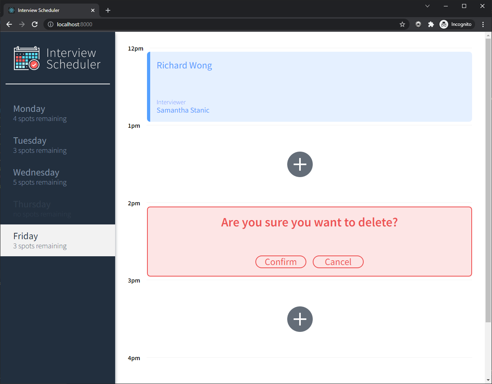

<h1 align="center"><a href="https://scheduler-project-lhl.netlify.app/">Interview Scheduler</a></h1> 

## Table Of Contents
- [Summary](#summary)
  - [Features](#features)
  - [Screenshots](#screenshots)
- [Setup](#setup)
  - [Dependencies](#dependencies)
  - [Resources](#resources)

# Summary
Interview Scheduler is a React application that allows users to book and cancel interviews. A combination of concise API and a WebSocket server are used to build a realtime experience.

> The app is deployed and can be viewed at [scheduler.hirzalla.ca](https://scheduler-project-lhl.netlify.app/).

## Features

- Uses WebSocket connection for a realtime user-experience (<i>view updates from other clients as they happen! </i>)
- Automated deployment: CI/CD using CircleCI, API server hosted on Heroku, app built and deployed at Netlify 
- Choose an available time-slot and book a new interview!
- Provide your name and choose one of the available interviewers for your appointment
- Edit or cancel an existing appointment
- View number of available spots remaining for each day
- Navigate through different days of the week from the sidebar

## Screenshots




## Setup
1. Clone this in addition to [scheduler-api](https://github.com/adamhirzalla/scheduler-api) repositories
2. Run both client and server (make sure to follow steps for running and seeding API server)
3. Visit http://localhost:8000
> <i>Needs the API server running alongside client. Run `cd scheduler-api && npm start`</i>

### Install Dependencies
```sh
cd scheduler && npm i
```

### Running Webpack Development Server

```sh
npm start
```

### Running Jest Test Framework

```sh
npm test
```

### Running Storybook Visual Testbed

```sh
npm run storybook
```

### Running Cypress E2E Tests

```sh
npm run cypress
```
> You'll need [scheduler-api](https://github.com/adamhirzalla/scheduler-api) server running alongside client in test environment for this. 
<br/> Run `npm run test:server` on the API server

## Dependencies
- [React](https://reactjs.org/)
- [Axios](https://github.com/axios/axios)
- [Classnames](https://github.com/axios/axios)
- [Normalize.css](https://www.npmjs.com/package/normalize.css?activeTab=versions)
- [React-DOM](https://www.npmjs.com/package/react-dom)
- [React-Scripts](https://www.npmjs.com/package/react-scripts)

### Dev
- [Babel-loader](https://www.npmjs.com/package/babel-loader)
- [Storybook](https://storybook.js.org/)
- [@testing-library/jest-dom](https://www.npmjs.com/package/@testing-library/jest-dom)
- [@testing-library/react](https://www.npmjs.com/package/@testing-library/react)
- [@testing-library/react-hooks](https://www.npmjs.com/package/@testing-library/react-hooks)
- [Cypress](https://www.npmjs.com/package/cypress)
- [Node-sass](https://www.npmjs.com/package/node-sass)
- [Prop-types](https://www.npmjs.com/package/prop-types)
- [React-test-renderer](https://www.npmjs.com/package/react-test-renderer)

## Resources
- [Heroku](https://www.heroku.com/)
- [CircleCI](https://circleci.com/)
- [Netlify](https://www.netlify.com/)
